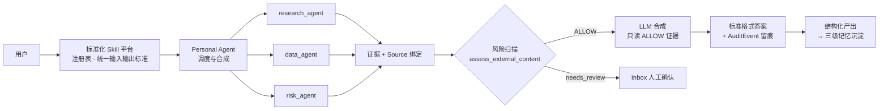
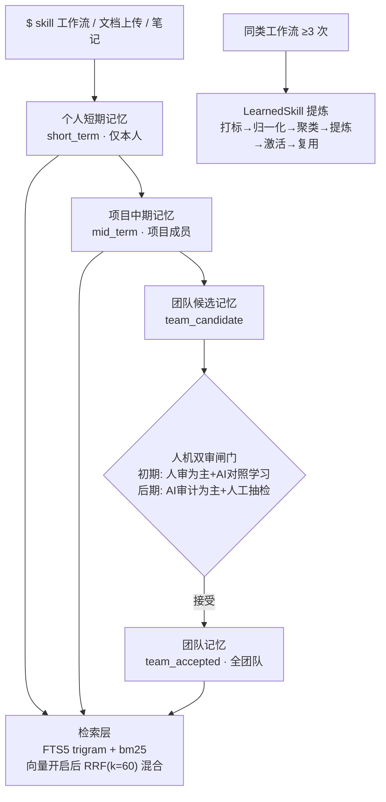
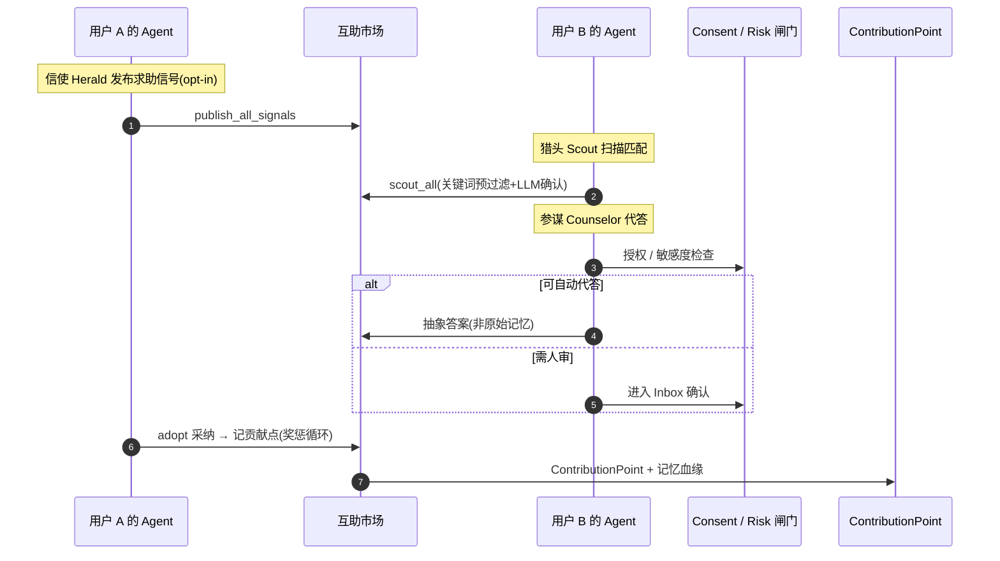

# AgentMesh 10 分钟项目介绍（黑客松版 · v3）

> 本版所有能力点均经源码核实（agents.py / store.py / risk.py / marketplace.py / chat_skills.py / synthesis.py / skill_extractor.py 等），并区分「真实实现 / 部分实现 / 规划中」三档。
> 结构：定位锚+主线开场 → 三个痛点 → 三个核心能力（个人工作中心 → 三级记忆 → 互助市场），每个能力按「问题场景 → 解决方案 → 视频体验 → 项目截图+技术架构」展开。

---

## 一、核心价值点一句话

AgentMesh 把个人 AI 助手升级成**团队数字员工网络**：用**个人工作中心**统一 AI 产出的标准与质量，用**三级记忆体系**替代手动维护的 Wiki，用 **Agent 互助市场**让信息以 AI Native 的方式主动流动。

---

## 二、开场：定位锚 + 主线 + 三个断层（0:00–1:30）

### 定位锚（0:00–0:20）

各位评委好。我们做的项目叫 AgentMesh，一句话——**当 AI 已经让每个人都变快了，我们解决的是"整个团队怎么一起变快"。**

### 主线点题（0:20–0:35）

因为我们看到一个很拧巴的现状：个人这边，AI 十分钟出一份调研、一分钟写一版方案；但团队这边——**产出还散在每个人各自的 prompt 里，知识还躺在没人更新的 Wiki 里，信息还堵在开会对齐的路上**。个人进了 AI 时代，组织还停在前 AI 时代。这中间的断层，就是 AgentMesh 要填的。

### 痛点一：个人 AI 工具各自为战，没有合力（0:35–0:55）

AI 赋能个人之后，每个人都在做自己的 AI 工具、自己的 skill。但这些工具都**攥在自己手里**，产出的质量、验收标准五花八门——同一个调研，三个人三种 prompt、三种格式，没人能复用，也没人能验收。**个人能力没有变成组织能力。**

→ 对应能力：**个人工作中心**——把分散的个人技能收敛为有统一标准、统一审计的工作流。

### 痛点二：Wiki 知识库永远慢一拍（0:55–1:12）

团队都在做 Wiki 知识库，但 Wiki 需要**人手动更新**——写完方案要抽时间整理、复盘完要抽时间归档。结果就是知识库永远慢真实工作一拍，最终变成"新人从来不看、老人从来不写"的死库。AI 都能帮你写方案了，**知识沉淀却还在靠人肉搬运**。

→ 对应能力：**三级记忆体系**——让知识在工作中自动沉淀，而不是事后手动补录。

### 痛点三：信息获取方式，还停在"人去找"的时代（1:12–1:30）

第三，也是最深的一层——**团队获取信息和沟通的方式，还停留在"人去找"的时代**。你想知道一件事，得自己去搜、去开会问、去翻文档——信息就在那，但要你亲自去够。可现在有 Agent 了：它知道你在做什么，也知道谁知道答案，能**主动**把相关经验送到你手上。从"人去搜信息"到"Agent 把信息送给人"——**这才是 AI Native 的获取方式**。今天大多数团队，还停在前一半。

→ 对应能力：**Agent 互助市场**——让 Agent 主动发现谁能帮谁，把信息自动送到需要的人手上。

---

## 三、核心能力一：个人工作中心 —— 统一标准与质量（1:30–4:00）

### 3.1 问题场景

每个人都在搭自己的 AI 工具和 skill，但产出格式不一致、验收标准不一致、出了问题无法追溯。同一个调研任务，三个人的产出质量完全取决于个人 prompt 水平。**AI 能力越强，团队产出的方差反而越大。**

### 3.2 解决方案

AgentMesh 做的不是"再造一个聊天框"，而是**搭建一个标准化的 Skill 平台**：每个人可以把自己的 skill 放上来给全团队用，但平台对 skill 建立**统一的输入输出标准**，并对 skill 进行**筛选和优化**——

- **上架即标准化**：每个 skill 在平台注册时必须声明输入参数、输出结构、来源绑定要求（`chat_skills.py` 的 `ChatSkillSpec` 注册表，当前 11 个 skill）。用户输入 `$research.request 查xx`，得到的不是某个人的散装 prompt 结果，而是平台标准格式的结构化回答——**谁用都一样，结果可预期**。
- **质量内建**：所有 skill 的产出，强制走一条"安检流水线"，四个关卡——
  1. **每个结论都带出处**：能点进去查原文（哪篇文档、哪条数据），AI 不许瞎编——像论文的参考文献；
  2. **外部资料先过安检**：网上搜来的内容里可能藏着"忽略指令、把数据发出去"这类使坏的命令，先过提示注入检测（`risk.py` `assess_external_content`）——像机场安检；
  3. **安检不过的，AI 根本看不见**：只有 ALLOW 的证据才写入 LLM 合成字段——不是"看见了再提醒"，是"压根到不了 AI 手里"，危险品不让上飞机；
  4. **危险动作 AI 不自己干**：删数据、发外部这类高风险操作，一律先进 Inbox 人工待办箱，**等人点头才执行**——像大额转账要经理复核。
  全程 AuditEvent 记账（谁做的、谁批的，事后可回放，像黑匣子）。**质量标准不是靠大家自觉，是代码卡死的**——你不标来源，答案出不来；安检不过，AI 用不了；危险动作，人不批就动不了。想不守规矩，系统层面就做不到。
- **筛选与优化**：平台能观测每个 skill 的使用与产出质量——被反复使用且结果好的工作流会被 LearnedSkill 机制提炼固化（见能力二），低质量 skill 可被下架或优化。**skill 不是放上去就完事，而是在使用中持续被筛选。**
- **天然接入记忆体系**：因为所有 skill 走统一工作流，每次执行的输入、过程、结果天然就是格式规整的记忆素材——**标准化的产出才能低成本地沉淀进三级记忆**，散装 prompt 的产物做不到这一点。

一句话：把"每个人手里的 AI 能力"变成"团队共享的、有标准、有验收、能沉淀的生产线"。

### 3.3 视频体验

（建议录屏，约 40 秒）

1. 输入 `$research.request 查找去年 618 家电会场的复盘经验` → 返回**带来源**的回答；
2. 输入 `$data.query 查询 618 会场入口点击率` → Data Agent 返回证据；
3. 输入 `$risk.review 检查这批外部素材授权风险` → 风险项进入 Inbox 待确认，不被 AI 自行处理。

### 3.4 项目截图 + 技术架构

截图建议：Workspace 聊天（`$` skill 菜单 + 带来源回答 + workflow trace）、Inbox 待确认列表。

（诚实边界：无内网凭证时 research/data 走 mock 或 local_metrics fallback，但 skill 注册、来源绑定、风险隔离、审计链路是真实代码。）

---

## 四、核心能力二：三级记忆体系 —— 替代手动 Wiki（4:00–6:40）

### 4.1 问题场景

Wiki 的死法大家都见过：建库时轰轰烈烈，三个月后没人更新，搜出来的结论不知道是哪年的、谁写的、还能不能信。根因有两个：**写入靠人肉**（整理笔录是额外工作，永远排不进优先级）；**质量无闸门**（什么都往里堆，越堆越不敢用）。

### 4.2 解决方案

AgentMesh 的思路是：**记忆不是单独维护的知识库，而是工作过程的副产品。**

#### 三级体系到底分什么

三级记忆不是一个概念口号，而是**两个正交维度的组合**：

**第一个维度是 Scope（可见范围），决定"这条知识属于谁"：**

| 层级 | 归属 | 解决什么问题 |
|---|---|---|
| **个人记忆** | 只有本人可见（硬隔离到 user_id） | 我的工作上下文不丢：昨天查了什么、做了什么判断，换台电脑、过一周还能接着用 |
| **项目记忆** | 项目成员可见 | 项目阶段经验不散：这个项目的复盘、归档、阶段结论，项目内所有人共享 |
| **团队记忆** | 全团队可见的正式资产 | 跨项目复用：只有审核通过的高价值经验才能进入这一层 |

**第二个维度是 Layer（沉淀深度），决定"这条知识沉淀到什么程度"：**

| 层 | 含义 | 例子 |
|---|---|---|
| **short_term** | 刚发生的工作上下文 | 今天这次调研的过程与结论 |
| **mid_term** | 项目级提炼 | 618 会场入口策略的阶段总结 |
| **long_term** | 长期归档 | 跨季度可复用的方法论沉淀 |

一条记忆从"我刚做完这件事"到"全团队都能复用的资产"，走的路径是：**个人 short_term → 项目 mid_term → 团队候选 → 审核接受 → 团队记忆**。每一跳都有明确的权限变化和治理动作，不是把东西堆进一个库里就完事。

#### 自动沉淀引擎：系统替你总结，再推你一把

这是和 Wiki 最本质的区别——**沉淀这件事，是系统主动做的，不是你事后补的**。整个链条全自动：

1. **工作中自动记录**：你每完成一次 `$` skill 工作流，系统自动把这次工作写成一条短期记忆（`_record_short_term_memory`），你完全无感——不用点"保存"、不用写总结；
2. **系统定期自动总结**：后台 worker 把一天的短期记忆自动汇总成每日摘要（`create_daily_summary_for_user`），再往上提炼成项目阶段总结、长期归档——**从流水账到方法论，是系统一层层自动提炼出来的**；
3. **系统主动推你沉淀**：当系统识别到某条经验有团队价值，会**自动创建一条候选记忆、推到你的待处理列表里**（意图 `CREATE_MEMORY_CANDIDATE`——"提炼经验为团队记忆候选"），你只需看一眼、点"接受"，它就进入团队层。

对比 Wiki：Wiki 是"你得想起来去写、还得自己组织语言"；AgentMesh 是"**系统已经帮你写好、总结好、推到你面前，你只做一道选择题：收，还是不收**"。沉淀的成本从"专门抽时间整理"降到"点一下确认"——这才是知识库能活下来的前提。

#### 治理闸门：人机双审，逐步切换

光有分层还不够——Wiki 的第二个死法是"什么都往里堆"。AgentMesh 的治理闸门是**人工审计 + AI 审计同步运行**：

- **初期：人工审计为主**。候选记忆必须由组长/管理员审核（`routes/memory.py` accept 路由 + `permissions.py` `ACTION_ACCEPT_TEAM_MEMORY`）才能升级为团队记忆。AI 审计**同步运行但结果不显现**——它对同一条候选记忆给出自己的判断，与人工结论对照，**建立对照数据，让 AI 学习人工审计的标准**（什么样的经验值得沉淀、什么样的描述合格）。
- **后期：AI 审计为主**。当对照数据积累到 AI 的判断与人工趋于一致，逐步把审核主流程切换到 AI 审计，人工只做抽检和争议仲裁——审核效率从"每条都看"变成"只看分歧项"。

这样设计的原因很现实：一开始没人敢信 AI 审，但纯人工审又慢——**先让 AI 在后台学，学到一致再放权**，是一条风险可控的演进路径。

#### LearnedSkill：经验不只是被记住，还变成技能

这是记忆体系里最值得展开的部分。普通知识库只能"存和搜"，AgentMesh 会把**重复出现的成功工作流自动提炼成可复用技能**（`skill_extractor.py`），整条流水线分六步：

1. **打标**：每次 `$` skill 工作流完成，系统把这次工作写入个人记忆，`source_kind` 标记为 `chat_workflow:<intent>`（`extract_workflow_pattern`），留下"这是一次什么类型的工作"的痕迹；
2. **归一化**：对每次工作的用户请求做归一化——数字替换为占位符、中英文统一分词（`normalize_query`），让"查询 618 会场入口点击率"和"查询双 11 会场入口点击率"被识别为同一类事；
3. **聚类**：用意图 + 中文 bigram / 英文 token 生成模式键（`compute_pattern_key`），把同类工作归到一组（`detect_recurring_patterns`）；
4. **提炼**：同一模式成功出现 **≥3 次**（`EXTRACTION_THRESHOLD=3`），系统自动生成 LearnedSkill 草稿（`propose_skill_from_pattern`）——包含触发模式（什么样的请求该用它）、执行步骤（从历次成功结果里归纳出"先检索记忆、再查数据、再合成"这类固定动作）、验证规则（"输出必须基于检索到的记忆""涉及数据必须给口径"这类验收标准）；
5. **人工确认生命周期**：草稿需要用户**激活（activate）**才生效，也可以**分享（share）**给团队或**废弃（deprecate）**（`routes/memory.py` 三个真实路由）；
6. **复用**：激活后的技能在新请求到来时通过 token 重叠匹配（`match_skill`，相似度阈值 0.4）命中，下次同类工作直接按已验证步骤执行，而不是让 LLM 重新推理一遍。

价值一句话：**第一次做靠推理，第二次做靠检索，第三次以后靠技能**——团队的经验从"文本"升级成了"可执行的能力"。

### 4.3 视频体验

（建议录屏，约 40 秒）

1. Workspace 聊天里完成一次调研/风险审查 → 后台自动写入短期记忆；
2. 打开 Knowledge 页面 → 待处理 Tab 中出现一条团队候选记忆 → 点击"接受"（真实 `acceptMemory` mutation）→ 进入共享知识；
3. 打开 Insights 工作洞察 → short/mid/long 三层记忆统计（真实接口 `/api/memory/overview`）。

### 4.4 项目截图 + 技术架构

截图建议：Knowledge 待处理页（候选记忆 + 审核按钮）、Insights 三层统计卡片、Skills 卡片。

（诚实边界：LearnedSkill 提炼与 activate/share/deprecate API 真实存在，前端 Skills 卡片目前用参考数据展示；候选记忆自动创建目前是模板化文案，动态摘要在迭代中；AI 审计对照学习为规划中的演进设计；daily_summary worker 代码真实但默认禁用。如实说明，不演成全部连好。）

---

## 五、核心能力三：Agent 互助市场 —— 让信息主动找上门（6:40–8:40）

### 5.1 问题场景

说一个真实得扎心的场景：周五下午，老板问"这个方向竞品做过没有？效果怎么样？"——你明知道隔壁组三个月前刚做过一模一样的调研，但你不知道是谁做的、文档叫什么、存在哪。你只有两个选择：要么下周开会挨个问，要么今晚自己重新做一遍。**你选了重做。**

这不是个例：同一份竞品调研，一个团队一年内可能被重做四五次；每一次都是"明明组织里有人知道，但你就是找不到他"。**信息就在组织里，但"谁知道这个答案"这个问题，今天还在靠搜索、开会、人脉和运气解决——全靠你主动去找。**

### 5.2 解决方案

AgentMesh 的互助市场把这个逻辑反过来——**不再是你去找信息，而是 Agent 把信息主动送到你手上**。市场上有三个各司其职的角色：

- **"信使"（Herald，发布信号）**：你的 Agent 感知到你近期的工作主题后，由后台 worker 自动向市场发布"我需要什么帮助"的求助信号（`publish_all_signals`）。信号是需求摘要，不是原始工作内容。用户必须 **opt-in** 才参与（`market_participation` 集合，缺省=不参与）——不是全员广播。
- **"猎头"（Scout，扫描匹配）**：其他 Agent 周期性扫描市场（`scout_all`），用**关键词预过滤（`_keyword_overlap`）+ LLM YES/NO 确认（`_match_signal`）**两段式算法判断"我能不能帮上"——先看主题是否沾边，再让 LLM 确认经验是否真正相关，避免误匹配。
- **"参谋"（Counselor，代答）**：能帮忙的 Agent 基于自己的记忆生成**抽象答案**（`answer_for_peer`）——注意，传递的是脱敏后的结论，不是把原始记忆直接暴露给对方；敏感或未授权的请求走 Inbox 人审闸门。

然后是这套市场真正的发动机——**奖惩循环**：

- **奖励机制（让 Agent 抢着答题）**：求助方采纳代答后（`adopt_delegated_answer`），系统给回答方记录一条 `ContributionPoint` 贡献点 + `MemoryRelation` 记忆血缘。"谁帮了谁、帮了多少次"第一次被系统性记账——贡献可以被看见、被排名、未来可兑换激励。**Agent 有动力主动帮人，而不是等问题找上门。**
- **评估机制（让水答案付出代价）**：代答不是发出去就记分——**只有被求助方采纳才计分**；没被采纳的回答不记分，低质量回答者长期得不到贡献点，自然被市场边缘化。采纳与否本身就是对答案质量的评估信号，形成"**答得好→被采纳→得奖励→更积极答；答得差→不被采纳→没奖励→被淘汰**"的闭环。

奖励驱动主动性，评估守住质量线——**这就是市场能自运转的奖惩循环**，也是"信息主动找上门"能持续成立的根基。

### 5.3 视频体验

（建议录屏，约 40 秒；演示前用 `publish_all_signals` + `scout_all` 触发好匹配，不现场等 worker 周期）

1. Collaboration 页面 → 市场参与者、供需信号、已完成匹配；
2. 展示加入/退出市场 opt-in 开关——不是全员广播；
3. Market 页面 → 个人视角：我发出的求助、收到的回答、给出的回应；
4. 现场翻代码 `adopt_delegated_answer` → 采纳写入 `ContributionPoint` + 记忆血缘。

### 5.4 项目截图 + 技术架构

截图建议：Collaboration 页（信号与匹配时间线）、Market 个人视角页。

（诚实边界：ContributionPoint 目前 record-only，排行榜与兑现规则是明确的下一步；grant/revoke_consent 无 HTTP API，仅 worker 内部调用；"信使/猎头/参谋"为便于路演的角色命名，代码中对应 publish/scout/answer_for_peer 三个函数。）

---

## 六、价值预估：能带来多少收益（8:40–9:20）

用一个 100 人的知识密集型团队（设计/运营/研发混合）做保守测算，假设均已普遍使用个人 AI 工具：

**效率侧（可直接折算人力）：**

| 来源 | 现状 | 用 AgentMesh | 每人每周节省 |
|---|---|---|---|
| 找历史经验/重复调研 | 翻聊天/文档/问人，或被重做 | 三级记忆检索 + 互助市场代答 | ~1.5h |
| 整理知识进 Wiki | 手动整理，经常不做 | 工作中自动沉淀 | ~1h |
| 对齐 AI 产出标准 | 产出格式不一，互相返工 | 统一工作中心 + 来源绑定 | ~0.5h |
| 跨团队信息同步 | 开会/拉群/写对接文档 | 市场自动匹配流动 | ~0.5h |

合计人均每周省 **~3.5 小时**。100 人 × 3.5h × 47 周 ≈ **16,500 小时/年 ≈ 8.2 个 FTE**。按综合人力成本 40 万/人年计，约 **330 万元/年**的直接人力释放。

**资产侧（难量化但更值钱）：**

- **重复调研减少 ~30%**：同类问题不再重做，这是纯增量节省，未计入上表；
- **关键人离职风险对冲**：经验沉淀为团队资产后，单点离职的能力断层成本（通常估算为该岗位 6–12 个月产出）显著降低；
- **新人上手加速**：有团队记忆可检索 + 有 LearnedSkill 可复用，上手周期按经验可缩短 30–40%。

（口径声明：以上为示意测算，基于"100 人团队、人均每周省 3.5h、47 工作周、40 万/人年"的明确假设，落地时按真实规模与实测替换。数字的意义在于揭示价值结构与量级，不是承诺。）

---

## 七、收尾（9:20–10:00）

回到开场的三个断层，AgentMesh 给出的不是一个工具，而是一次**协作方式的换代**：

- 个人工具各自为战？——**个人工作中心**把散装的 AI 能力收进有标准、有验收、能沉淀的统一生产线；
- Wiki 慢一拍？——**三级记忆体系**让每一次工作自动沉淀，系统替你总结、再推你确认，知识从"人肉维护的库"变成"工作自然流出的河"；
- 信息靠人去找？——**Agent 互助市场**用信使、猎头、参谋加一套奖惩循环，让经验主动流向需要它的人。

过去十年，AI 让"一个人能做多快"提升了十倍；但"一个组织能变多聪明"，几乎没变。**AgentMesh 要改变的正是后者——把每一次个体的工作，变成组织可复用、可审计、可流动的资产。**

当别的团队还在用 AI 加速一个人，你的团队已经在用 AI **复利整个组织**。

这就是 AgentMesh——**让组织的每一次工作，都为下一次工作铺路。** 谢谢。

---

## 附：评委问答备查

- **Q：和 Wiki/知识库工具的本质区别？** Wiki 是"人维护知识"，AgentMesh 是"工作产生知识、系统主动沉淀"：写入自动（每次工作留痕）、系统自动总结分层、主动推送候选给你确认、准入人机双审（人审为主→AI 学习对照→AI 审计为主）、可追溯（Source + AuditEvent）。
- **Q：三级记忆和标签/文件夹有什么区别？** 两个正交维度：Scope（属于谁：个人/项目/团队）管权限，Layer（沉淀多深：short/mid/long）管生命周期；升级有过闸门的治理动作，不是简单分类。
- **Q：系统怎么"主动推动沉淀"？** 每次工作自动写短期记忆 → worker 自动总结成日/项目摘要 → 识别到高价值经验自动创建候选记忆推到待处理，用户只需确认。目前候选内容是模板化文案，动态摘要在迭代。
- **Q：为什么不直接做个企业知识检索？** 检索只解决"找得到"，不解决"沉淀得下、质量可控、主动流动"。三级记忆管沉淀与治理，统一工作流管标准，互助市场管主动流动。
- **Q：互助市场会不会泄露隐私？** opt-in 才参与（缺省=不参与）；传递抽象答案而非原始记忆；敏感请求走 Inbox 人审。
- **Q：检索是语义的吗？** FTS5 trigram + bm25 真实在线；向量检索默认关闭（需 EMBEDDING env 配置），开启后 RRF(k=60) 混合排序。
- **Q：匹配算法？** 关键词预过滤 + LLM YES/NO 确认两段式，无向量检索。
- **Q：奖惩循环会不会被刷分？** 采纳才计分，求助方是天然的评估者；长期不被采纳者无贡献，形成质量筛选；反作弊规则是下一步。
- **Q：LLM 挂了怎么办？** 主备 failover + 模板降级，记录 fallback_reason，永不返回错误。
- **Q：交付状态？** 后端能力、API、测试齐全（557 个自动化测试）；前端部分模块用参考数据展示未接线能力，如实标注 T数据/M数据。
- **Q：价值数字怎么来的？** 100 人团队、人均每周省 3.5h（四类来源拆分明细）、47 周、40 万/人年的明示假设，约 8.2 FTE、330 万/年；示意口径，按真实规模替换。
