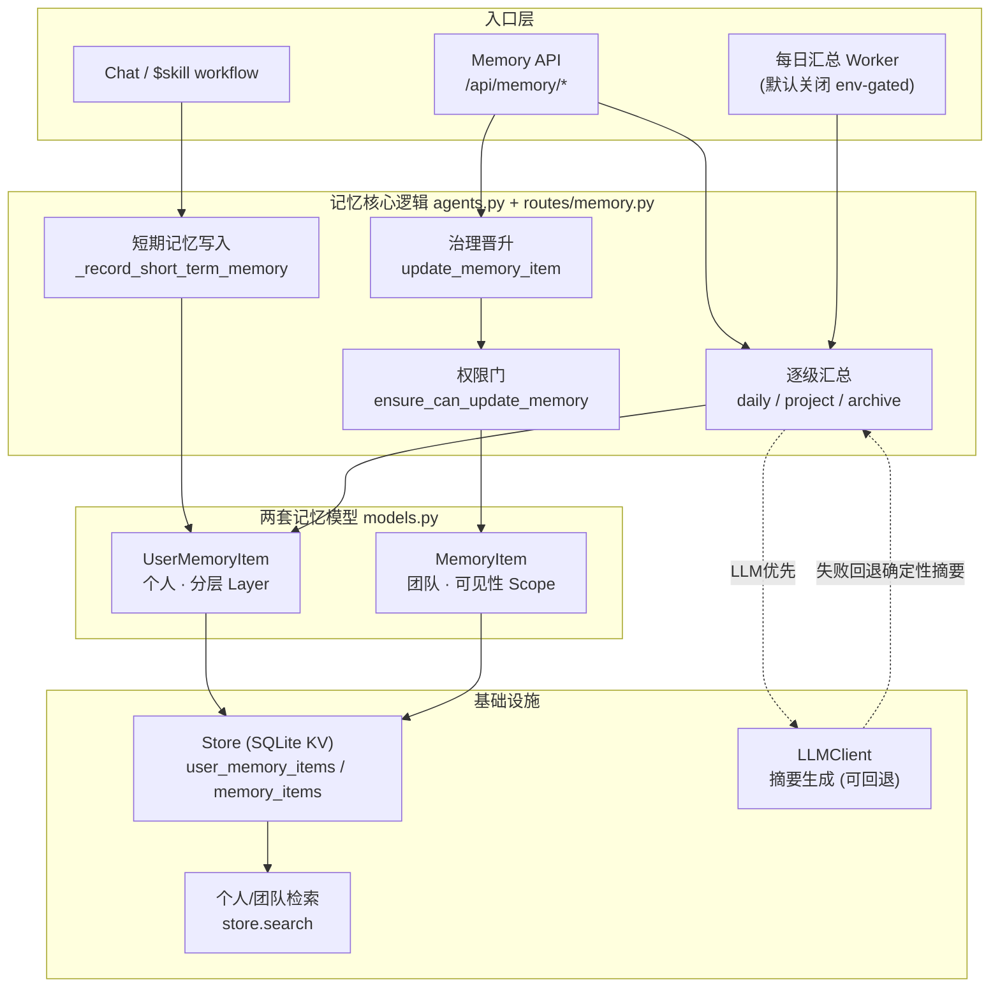
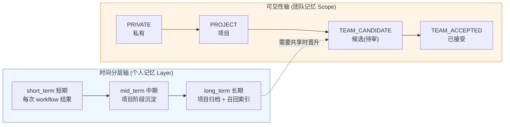
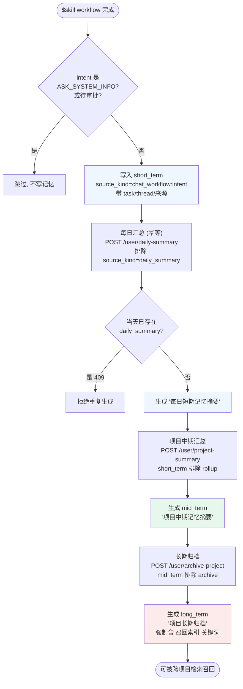
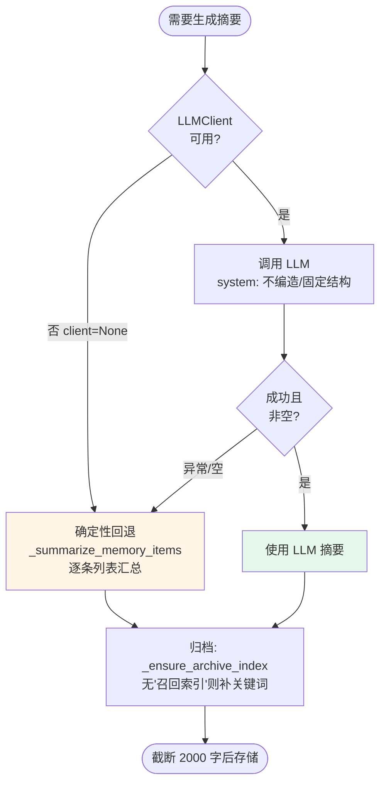
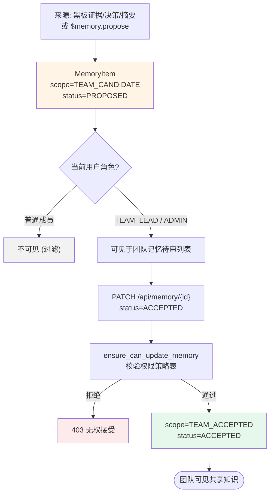
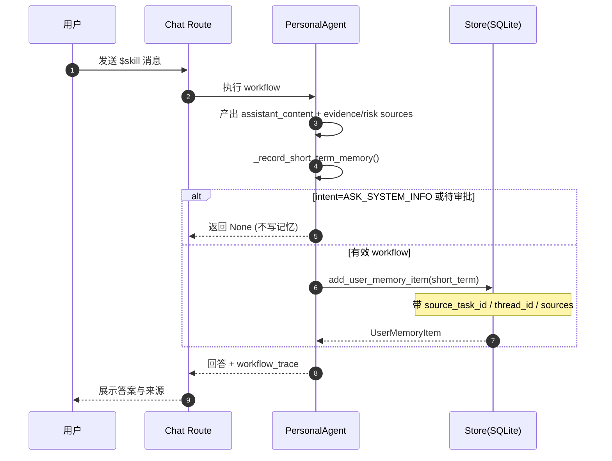
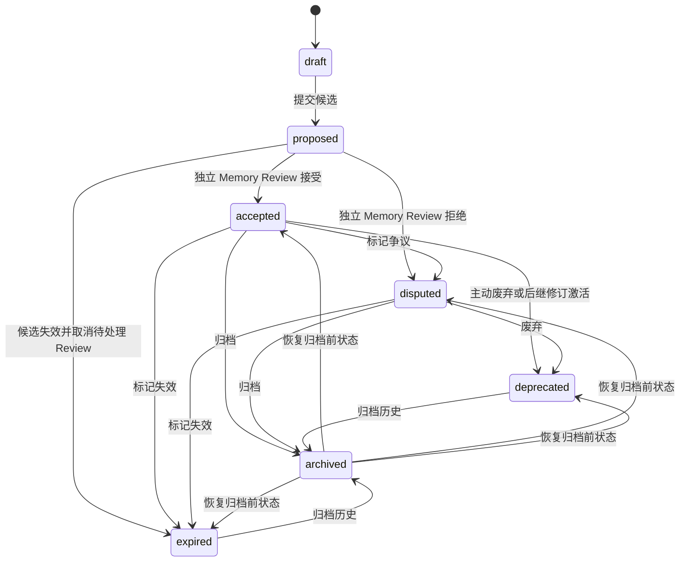

# AgentMesh 记忆架构图解

> 图解范围：双记忆模型、可见性(Scope)与时间分层(Layer)双轴、逐级汇总管线、团队治理晋升、写入时序、状态机。
> 代码锚点：`agentmesh/models.py`、`agentmesh/routes/memory.py`、`agentmesh/agents.py`、`agentmesh/store.py`。

---

## 1. 总体架构图（组件视图）

两套记忆模型 + 存储 + 汇总管线 + LLM + Worker + 检索的整体关系。



---

## 2. 双轴示意图（设计核心）

记忆被两条**正交**的轴管理：可见性(Scope) 管"谁能看"，时间分层(Layer) 管"存多久 / 多浓缩"。个人记忆走 Layer 轴沉淀，需要共享时才跨到 Scope 轴晋升为团队记忆。



---

## 3. 分层汇总管线流程图（越老越浓缩）

个人记忆的核心生命周期：写入 → 每日汇总 → 项目中期 → 长期归档。每级都排除上一轮自身产物，防止自我循环汇总。



---

## 4. 摘要生成：LLM 优先 + 确定性回退

中期/归档摘要的生成策略，保证无模型环境下不塌。



---

## 5. 团队记忆治理晋升流程图（带权限门）

个人/黑板证据晋升为团队记忆，必须过角色权限门；候选仅 lead/admin 可见。



---

## 6. 写入时序图（对话 → 短期记忆）

一次 `$skill` 对话如何落成一条短期记忆。



---

## 7. 记忆状态机（MemoryStatus）

团队记忆并非只增不减，可被争议、废弃、过期。



Accepted 团队知识不可原地改写。修订会创建新的 proposed 记录并冻结来源 Memory 的 ID、版本和内容哈希；只有新候选的独立 Memory Review 接受后，才在同一事务中激活新版本并将前一版置为 deprecated。若同一前驱已经存在 accepted 后继，则 archived-from-accepted 的旧后继不得恢复，避免同时出现两个 active successor。

## 8. 记忆上下文与使用回执

搜索命中不等于已使用。`MemoryContextService` 在权限、生命周期、AgentMemoryBinding、Scope、MemoryLayer、FTS/Vector 排序和预算完成后，才形成可进入模型的上下文。实际进入某个 Agent Run 的每个 Memory 版本都会写入一个不可变 `MemoryUseReceiptV1`：

```text
Run / Task
  → Memory ID + record version + versioned content hash + retrieval layer
  → retrieval reason + query hash
  → stable citation label
  → Agent ID + original Source IDs
```

自动上下文默认 `off`，可先使用 `observe` 仅测量，再切换到 `inject`。显式 Runtime `memory_search` 仅在输出编码、大小限制、安全检查、审计和 Tool call settlement 全部成功后写回执；被隔离或改写的输出不记为使用。Memory 标题、摘要和实际暴露的 Source metadata 在候选上限前应用 credential / prompt-injection quarantine。Memory 后续 disputed、deprecated、expired、archived 或被新版本取代，都不能改写历史 Run 当时使用的版本事实。

每个 Run 的 Citation 先通过 `BEGIN IMMEDIATE` 事务保留，reservation 不是使用事实，也不出现在 Run/Memory 使用历史中。这样并发的不同查询不会把同一个 `[T1]` 分配给两个 Memory 版本。

Scope 与 MemoryLayer 是独立维度：Scope 决定谁可见，Layer 决定检索深度，并在排序与上下文预算前过滤。新 governed shared Memory 保存显式 Layer；缺少显式 Layer 的 legacy Project Memory 按 mid-term、Team Knowledge 按 long-term 投影，不回写或伪造旧记录。`max_total_chars` 约束完整渲染 payload，而不是只计算 title/summary。

---

## 图例速查

| 颜色 | 含义 |
|---|---|
| 蓝 | 短期 / 个人记忆写入 |
| 绿 | 成功 / 已接受 / 高层沉淀 |
| 橙 | 候选 / 待审 / 回退路径 |
| 红 | 拒绝 / 归档 / 高危 |
| 灰 | 被过滤 / 跳过 |
