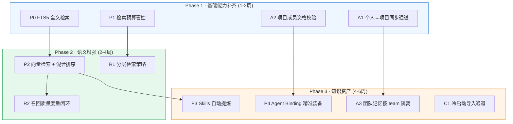
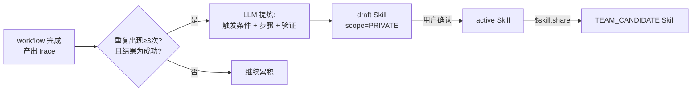
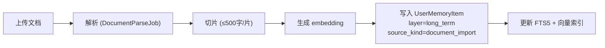

# AgentMesh 记忆系统优化方案

> 基于 TencentDB-Agent-Memory 对比分析 + 当前实现偏差修复，按 ROI 排序的落地计划。
>
> 代码锚点：`agentmesh/store.py`、`agentmesh/models.py`、`agentmesh/routes/memory.py`、`agentmesh/agents.py`、`agentmesh/permissions.py`。

---

## 一、优化全景



---

## 二、Phase 1 · 基础能力补齐

### P0 — FTS5 全文检索替换字符串匹配

**现状问题**：`store.py:557` 的 `search()` 使用 `needle in value.lower()`，O(N) 全表扫描，不支持分词、不支持相关性排序、无法处理中文同义词。

**方案**：

```python
# store.py 新增 FTS5 虚拟表
CREATE VIRTUAL TABLE IF NOT EXISTS memory_fts USING fts5(
    collection,        -- 来源集合标识
    record_id,         -- 原始 records.id
    title,
    summary,
    scope,
    workspace_id,
    project_id,
    user_id,
    tokenize='unicode61 remove_diacritics 2'  -- 中文 unicode 分词
);
```

**改动范围**：
- `store.py`：`_ensure_schema` 加 FTS5 表；`_upsert` 写入时同步写 FTS；`search()` 改用 `MATCH` + `bm25()` 排序
- `models.py`：无变化
- `routes/memory.py`：无变化（search 是内部方法）

**检索逻辑升级**：
```python
def search(self, query: str, allowed_scopes: set[Scope], ...) -> list[SearchResult]:
    # 1. FTS5 BM25 排序
    rows = connection.execute("""
        SELECT record_id, collection, rank
        FROM memory_fts
        WHERE memory_fts MATCH ?
          AND scope IN ({scopes})
          AND (workspace_id = ? OR workspace_id IS NULL)
        ORDER BY rank
        LIMIT ?
    """, (fts_query, workspace_id, max_results))

    # 2. 加载完整对象并过滤权限
    # 3. 返回带 relevance_score 的结果
```

**收益**：中文分词准确率提升、检索速度从 O(N) 降至 O(log N)、支持相关性排序。

---

### P1 — 检索预算管控

**现状问题**：`search()` 和 `_search_team_brain()` 返回结果无上限控制，大量记忆积累后会撑爆 LLM context window。

**方案**：

```python
@dataclass
class SearchBudget:
    max_results: int = 10           # 最多返回条数
    max_chars: int = 4000           # 总字符预算
    timeout_ms: int = 3000          # 检索超时
    layer_priority: list[str] = field(
        default_factory=lambda: ["long_term", "mid_term", "short_term"]
    )  # 优先召回高层记忆（越浓缩越优先）
```

**改动范围**：
- `store.py`：`search()` 增加 `budget: SearchBudget` 参数，按 score 排序后截断
- `agents.py:477`：`_search_team_brain` 使用 budget 控制，优先返回 long/mid 层
- `synthesis.py`：注入 LLM 的记忆上下文受 `max_chars` 限制

**截断策略**：
```
结果按 relevance_score 降序排列：
1. 先填充 long_term / TEAM_ACCEPTED（高价值浓缩记忆）
2. 再填充 mid_term / PROJECT
3. 最后填充 short_term / PRIVATE
4. 达到 max_chars 时截断，附带 "还有 N 条未展示" 提示
```

---

### A1 — 个人→项目同步通道

**现状问题**：`UserMemoryItem(mid_term, PRIVATE)` 和 `MemoryItem(scope=PROJECT)` 之间没有任何自动/半自动流转通道。个人项目沉淀永远是私有的。

**方案**：新增 API `POST /api/memory/user/{item_id}/share-to-project`

```python
@router.post("/user/{item_id}/share-to-project", response_model=ItemResponse)
def share_user_memory_to_project(item_id: str, user: User = Depends(current_user)) -> ItemResponse:
    """将个人记忆同步到项目空间，项目成员可见。"""
    source_item = store.get_user_memory_item(item_id)
    if source_item is None or source_item.user_id != user.id:
        raise HTTPException(404, "Memory not found")

    # 创建项目共享记忆
    shared = MemoryItem(
        title=source_item.title,
        summary=source_item.summary,
        memory_type=source_item.memory_type,
        scope=Scope.PROJECT,
        status=MemoryStatus.ACCEPTED,  # 项目内直接生效，无需审核
        workspace_id=source_item.workspace_id,
        project_id=source_item.project_id,
        sources=source_item.sources,
    )
    store.add_memory_item(shared)

    # 记录血缘关系
    store.add_memory_relation(MemoryRelation(
        from_memory_id=shared.id,
        to_source_id=source_item.id,
        relation_type="shared_from_personal",
    ))
    return ItemResponse(item=shared)
```

**Chat Skill 入口**：`$memory.share <记忆标题关键词>` → 搜索个人记忆 → 确认后同步到项目。

---

### A2 — 项目成员资格校验

**现状问题**：`scope=PROJECT` 的记忆按 `project_id` 过滤，但不验证"当前用户是否属于该项目"。任何知道 `project_id` 的人都能搜到。

**方案**：

1. `Project` 模型增加 `member_ids` 字段：
```python
class Project(BaseModel):
    id: str = Field(default_factory=lambda: new_id("proj"))
    name: str
    workspace_id: str
    member_ids: list[str] = Field(default_factory=list)  # 新增
    ...
```

2. 检索时校验：
```python
def _user_can_access_project(self, user: User, project_id: str) -> bool:
    project = store.get_project(project_id)
    if project is None:
        return False
    return user.id in project.member_ids or user.role in {UserRole.ADMIN, UserRole.TEAM_LEAD}
```

3. `search()` 中对 `scope=PROJECT` 的结果过滤：只返回用户所属项目的记忆。

---

## 三、Phase 2 · 语义增强

### P2 — 向量检索 + 混合排序（RRF）

**现状**：纯词法匹配，"部署失败"搜不到"发布异常"这样的语义近义。

**方案（三选一，按环境约束递进）**：

| 方案 | 依赖 | 适合场景 |
|------|------|---------|
| A. sqlite-vec 扩展 | 无外部服务，纯嵌入 SQLite | 轻量部署、hackathon demo |
| B. FAISS 本地 | Python FAISS 库 | 单机中等规模 |
| C. 外部向量库 (Milvus/Qdrant) | 独立服务 | 生产环境、大规模 |

**推荐 A 方案（sqlite-vec）**，与当前 SQLite 存储无缝集成：

```python
# 写入时生成 embedding
def _upsert_with_embedding(self, collection: str, item: BaseModel, text: str) -> None:
    embedding = self.embed_fn(text)  # 384 维 embedding
    self._upsert(collection, item)
    connection.execute("""
        INSERT OR REPLACE INTO memory_vec(record_id, embedding)
        VALUES (?, ?)
    """, (item.id, serialize_f32(embedding)))

# 检索时混合 FTS5 + 向量
def hybrid_search(self, query: str, ...) -> list[SearchResult]:
    fts_results = self._fts_search(query, limit=20)      # BM25 词法
    vec_results = self._vector_search(query, limit=20)    # 余弦相似度

    # RRF (Reciprocal Rank Fusion) 融合
    return rrf_merge(fts_results, vec_results, k=60)
```

**Embedding 模型选型**：
- 中文优先：`bge-small-zh-v1.5`（384 维，115M 参数，可本地推理）
- 轻量替代：`text2vec-base-chinese`
- 远程服务：调用 LLM API 的 embedding 端点

---

### R1 — 分层检索策略

**借鉴 TencentDB 的 L2/L3 优先快速上下文恢复**。

```python
class LayeredRetrievalStrategy:
    """先粗后细的分层检索：高层快速入场，低层按需下钻。"""

    def retrieve(self, query: str, user: User, budget: SearchBudget) -> list[SearchResult]:
        # 第一步：long_term + TEAM_ACCEPTED（高层浓缩，快速 context 恢复）
        results = self._search_layer(query, layers=["long_term"], scopes=["team_accepted"])
        if self._budget_satisfied(results, budget):
            return results

        # 第二步：mid_term + PROJECT（项目级补充）
        results += self._search_layer(query, layers=["mid_term"], scopes=["project"])
        if self._budget_satisfied(results, budget):
            return results

        # 第三步：short_term + PRIVATE（精确事实下钻）
        results += self._search_layer(query, layers=["short_term"], scopes=["private"])
        return self._apply_budget(results, budget)
```

**何时下钻**：
- 高层命中且得分足够 → 不下钻（快速响应）
- 高层未命中或得分低 → 逐层下钻（精确召回）
- 用户显式要求"原始对话"→ 直接访问 short_term

---

### R2 — 召回质量度量闭环

**现状问题**：记忆写入了但对答案质量的贡献不可度量，无法迭代优化。

**方案**：

```python
class RetrievalMetrics(BaseModel):
    query_id: str
    query_text: str
    results_returned: int
    results_cited: int          # LLM 实际引用的记忆条数
    citation_coverage: float    # 引用率 = cited / returned
    user_feedback: str | None   # 可选：用户反馈（有用/无用）
    latency_ms: int
    created_at: datetime
```

**采集点**：
1. `_search_team_brain` 返回时记录 `results_returned`
2. `synthesize_with_llm_result` 完成后比对 LLM 输出中引用了哪些 source_id → `results_cited`
3. 定期汇总 `citation_coverage`，低于阈值则触发检索参数调优

---

## 四、Phase 3 · 知识资产

### P3 — Skills 资产（从 workflow trace 自动提炼）

**借鉴 TencentDB**：把"可复用工作流"提炼为独立资产，带版本、触发边界、执行步骤、验证规则。

**模型设计**：

```python
class LearnedSkill(BaseModel):
    id: str = Field(default_factory=lambda: new_id("skill"))
    title: str                          # "如何查询项目部署状态"
    trigger_pattern: str                 # 触发条件描述
    steps: list[str]                     # 执行步骤序列
    validation_rules: list[str]          # 验证规则
    source_workflow_ids: list[str]       # 来源 workflow trace
    version: int = 1
    status: str = "draft"               # draft → active → deprecated
    scope: Scope = Scope.PRIVATE        # 可晋升为团队 skill
    workspace_id: str
    project_id: str | None = None
    created_at: datetime = Field(default_factory=now_utc)
```

**提炼流程**：


**检索时匹配**：当用户发起新请求时，先用 trigger_pattern 匹配已有 Skill，命中则按 steps 执行而非重新推理。

---

### P4 — Agent Binding（精准装备）

**现状问题**：所有 Agent 共享同一份记忆池，协作市场中不同领域的 Agent 会被无关记忆污染。

**方案**：

```python
class AgentMemoryBinding(BaseModel):
    id: str = Field(default_factory=lambda: new_id("amb"))
    agent_id: str                       # 绑定到哪个 Agent
    memory_scope: Scope                 # 可访问的最高 scope
    allowed_memory_types: list[str]     # 允许的 memory_type
    allowed_project_ids: list[str]      # 限定项目范围
    max_results_per_query: int = 5      # 单次检索上限
    created_at: datetime = Field(default_factory=now_utc)
```

**检索时注入 binding**：
```python
def search_for_agent(self, query: str, agent_id: str, user: User) -> list[SearchResult]:
    binding = self._get_agent_binding(agent_id)
    if binding is None:
        return self.search(query, ...)  # 无绑定则全量

    # 按绑定限制检索范围
    return self.search(
        query,
        allowed_scopes={s for s in Scope if s.value <= binding.memory_scope.value},
        project_id=binding.allowed_project_ids[0] if binding.allowed_project_ids else None,
        max_results=binding.max_results_per_query,
    )
```

---

### A3 — 团队记忆按 team 隔离

**现状**：`TEAM_ACCEPTED` 记忆按 `workspace_id` 隔离，同一工作区的所有团队共享。

**方案**：`MemoryItem` 增加 `team_id` 可选字段：

```python
class MemoryItem(BaseModel):
    ...
    team_id: str | None = None  # 新增：归属团队，None 表示全工作区
```

**可见性规则升级**：
```python
def _visible_memory_items(user: User) -> list[MemoryItem]:
    user_team_ids = {m.team_id for m in store.list_team_memberships(user_id=user.id)}
    items = store.memory_items
    return [
        item for item in items
        if item.scope == Scope.TEAM_ACCEPTED
        and (item.team_id is None or item.team_id in user_team_ids)  # team 级过滤
        and item.workspace_id == user.workspace_id
    ]
```

---

### C1 — 冷启动导入通道

**借鉴 TencentDB 的三种冷启动**：文档→知识、代码→索引、历史对话→Skills。

**AgentMesh 当前基础**：已有 `DocumentRecord` 模型和 `DocumentParseJob`，但解析后的结果没有自动进入可检索记忆池。

**方案**：

| 来源 | 入口 | 产出 | 存储 |
|------|------|------|------|
| 文档上传 | `POST /api/documents` | 切片 + embedding | `UserMemoryItem(source_kind="document_import")` |
| 会议纪要/群聊 | `POST /user/group-summary` | 结构化摘要 | 已有，补 embedding |
| 历史 workflow trace | 定时扫描 | LearnedSkill | `learned_skills` 集合 |

**文档导入流程**：


---

## 五、实施优先级总表

| 编号 | 优化项 | 估时 | 前置依赖 | ROI |
|------|--------|------|---------|-----|
| **P0** | FTS5 全文检索 | 1-2d | 无 | ★★★★★ |
| **P1** | 检索预算管控 | 0.5d | 无 | ★★★★☆ |
| **A1** | 个人→项目同步通道 | 1d | 无 | ★★★★☆ |
| **A2** | 项目成员资格校验 | 1d | 无 | ★★★☆☆ |
| **P2** | 向量检索 + RRF | 3-5d | P0 | ★★★★☆ |
| **R1** | 分层检索策略 | 1-2d | P1 | ★★★★☆ |
| **R2** | 召回质量度量 | 2d | P2 | ★★★☆☆ |
| **P3** | Skills 自动提炼 | 5-7d | P2 | ★★★☆☆ |
| **P4** | Agent Binding | 3d | A2 | ★★★☆☆ |
| **A3** | 团队记忆 team 隔离 | 2d | A1 | ★★☆☆☆ |
| **C1** | 冷启动导入通道 | 3-5d | P2 | ★★☆☆☆ |

---

## 六、风险与降级

| 风险 | 影响 | 降级策略 |
|------|------|---------|
| sqlite-vec 扩展在生产环境不稳定 | P2 无法上线 | 退回 FAISS 文件索引或外部向量库 |
| Embedding 模型推理延迟过高 | 写入变慢 | 异步生成 embedding（写入时排队，后台 worker 处理） |
| FTS5 中文分词不准 | 检索召回率低 | 引入 jieba 分词预处理后写入 FTS |
| Skills 提炼误报率高 | 产生大量无用 Skill | 设阈值（≥3次成功+人工确认）才激活 |
| 项目成员校验引入性能回退 | search 变慢 | 缓存 user→projects 映射，TTL 5min |

---

## 七、与 TencentDB-Agent-Memory 的能力对照

| TencentDB 能力 | AgentMesh 当前 | 本方案覆盖 |
|---------------|---------------|-----------|
| L0-L3 四层分层 | short/mid/long 三层 | R1 分层检索策略对齐 |
| BM25+向量+RRF | 纯字符串匹配 | P0+P2 完整覆盖 |
| Skills 资产 | 硬编码 ChatSkillSpec | P3 自动提炼 |
| Wiki (LLM-Wiki) | DocumentRecord（未结构化） | C1 文档导入 |
| CodeGraph | 无 | 暂不引入（ROI 低于其他项） |
| Agent 级 ACL | 无 | P4 Agent Binding |
| 冷启动三通道 | seed.py 硬编码 | C1 覆盖 |
| 条目/字符/超时三重限制 | 无 | P1 完整覆盖 |
| Team/User/Agent 粒度 ACL | workspace 粒度 | A2+A3+P4 逐步细化 |

**不引入的能力（及原因）**：
- **CodeGraph**：AgentMesh 不是 IDE/开发工具，代码索引需求低
- **多版本 Skill**：当前阶段 Skill 数量少，版本管理过度设计
- **跨工作区迁移**：单工作区场景为主，后续按需加

---

## 八、落地建议

**第一步（本周）**：P0 + P1，最小改动最大收益。FTS5 替换现有 search，加预算参数。改动集中在 `store.py`，不影响 API 接口。

**第二步（下周）**：A1 + A2，修复架构偏差。新增 1 个 API + 1 个校验函数，让三层记忆的"同步"通道真正打通。

**第三步（2-3 周）**：P2 + R1，语义检索上线。需要选定 embedding 方案并灌入历史数据。

**后续按需求优先级选做**：P3/P4/A3/C1。

---

## 九、实施完成记录

| 编号 | 状态 | 提交 | 备注 |
|------|------|------|------|
| P0 | ✅ 完成 | 4eb7bdf | FTS5 trigram 全文检索 |
| P1 | ✅ 完成 | 4eb7bdf | max_results + max_chars 双预算 |
| A1 | ✅ 完成 | 4eb7bdf | 个人→项目同步 + MemoryRelation |
| A2 | ✅ 完成 | 4eb7bdf | member_ids 项目成员校验 |
| P2 | ✅ 完成 | 17e0ccf | Qwen3-Embedding + RRF 混合排序 |
| R1 | ✅ 完成 | dcda229 | TEAM→PROJECT→PRIVATE 分层检索 |
| A3 | ✅ 完成 | 3e15b0b | team_id + TeamMembership 隔离 |
| R2 | ✅ 完成 | 0a1a7f4 | citation rate + latency 度量 |
| P3 | ✅ 完成 | 1394f20 | bigram pattern 提取 + Skill 匹配 |
| P4 | ✅ 完成 | bbbc882 | AgentMemoryBinding 精准装备 |
| C1 | ✅ 完成 | — | 文档切片 → long_term 自动导入 |
