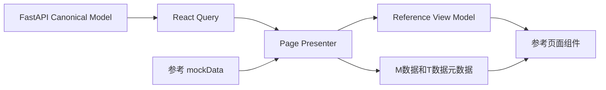

# AgentMesh 参考 UI 与真实数据混合展示设计

- 日期：2026-08-14
- 状态：已确认
- 参考前端：`/Users/heyunshen/Downloads/agentmesh-demo/`
- 实施前端：`agentmesh-demo/`
- 范围：我的数字人、工作洞察、我的知识、协作网络与协作详情、全局壳层和数据来源标识

## 结论

当前前端继续以 FastAPI 和 SQLite 作为身份、权限、状态和持久化的唯一事实源，同时把下载目录中的纯 Mock 前端作为视觉与产品表达基线。

页面迁移不再采用“一个后端 Endpoint 对应一张通用资源卡”的方式。每个页面增加 Presenter，将服务端 Canonical Model 转换成参考前端需要的 View Model。真实字段优先使用；后端暂未提供的展示字段允许使用参考 Mock 数据，但必须显示 `M数据`。来自当前后端并通过当前用户权限过滤的数据显示 `T数据`。

任何会改变服务端状态的操作都必须调用真实后端并服从 `allowed_actions`、版本、权限和状态机。没有后端能力时，操作应显示“能力暂未接入”，不得用本地状态或 Toast 伪造成功。

## 当前事实

两套前端的 `src/index.css` 和 `tailwind.config.js` 完全一致。背景、字体、卡片、圆角、阴影和颜色 token 没有丢失。当前页面差异主要来自以下改造：

1. 当前 `AppLayout` 的普通页面宽度从 `1240px` 扩大到 `1320px`，并在 2xl 使用 `1440px`。
2. 当前侧栏、设置抽屉、Tabs 和页面信息架构被重写。
3. DigitalSelf、Insights、Knowledge、Collaboration 直接围绕后端资源重组页面，而不是复用参考页面的展示结构。
4. 当前仓库仍保留不少参考组件和 Mock 数据，但正式页面不再挂载它们。
5. AI 工作台已经形成独立的真实会话、Skill、上传、搜索、执行依据和来源链路。本轮页面对齐不得破坏该链路。

## 开发基线冻结

实施开始前必须完成一次基线冻结，后续 Agent 不再自行重新解释参考页面或公共接口。

### 代码基线

1. 记录当前 `HEAD`、分支、工作区修改和未跟踪文件。
2. 当前前端可以构建且核心 Workspace Playwright 通过后，创建一个可回退的基线提交。提交、推送仍需用户明确授权。
3. 实施期间如果 `AppLayout`、共享 UI、四个目标页面或 Presenter 公共接口被其他任务修改，立即停止该波次，重新确认基线，不在漂移代码上继续叠加。

### 参考基线

1. 为 `/Users/heyunshen/Downloads/agentmesh-demo/` 中 App、Layout、四个页面和关联组件生成文件清单与 SHA-256。
2. 在 1512px 保存 DigitalSelf、Insights、Knowledge、Collaboration 和代表性 Drawer 的参考截图。
3. 页面 Agent 只读取任务简报中列出的参考文件，不再遍历整个参考项目。
4. 参考文件校验值变化时，必须先更新设计和截图，不静默使用新版本。

### 公共接口冻结

基础波次完成后冻结以下文件，页面 Agent 只能消费，不能修改：

- `agentmesh-demo/src/lib/presentation.ts`
- `agentmesh-demo/src/components/ui/DataSourceBadge.tsx`
- `agentmesh-demo/src/components/layout/AppLayout.tsx`
- `agentmesh-demo/src/components/layout/Sidebar.tsx`
- `agentmesh-demo/src/components/ui/Tabs.tsx`

四个页面并行实施时，每个 Agent 只拥有自己的 `pages`、`features/<page>/presenter.ts`、`components/<page>` 和对应测试文件。

### AI 工作台冻结

AI 工作台当前实现作为独立基线。页面对齐期间禁止修改 Workspace、Composer、ConversationThread、`features/workspace` 和聊天后端。每个波次结束后只运行一次 Workspace 聚焦回归，不在每个页面任务中重复执行。

## 目标

完成后应满足：

- 四个业务页面的视觉层级、模块顺序、卡片样式、Drawer 和主要文案尽量与参考前端一致。
- 真实用户、Workspace、Project、Task、Memory、Inbox、Document、Blackboard、Market 和 allowed actions 继续来自后端。
- 后端缺少的聚合指标、产品叙事、示例复盘和能力分布可使用参考 Mock 数据。
- 用户可以明确判断每个展示模块来自真实数据还是 Mock 数据。
- 同一模块同时使用真实和 Mock 数据时，各字段或子区块分别标注，不使用含糊的“混合数据”标签。
- 390px、768px 和 1512px 视口都保持可操作。
- AI 工作台的消息、自动滚动、历史恢复、`$` Skill、上传、搜索、执行依据和 P/J/T 记忆标注不回归。

## 非目标

本轮不新增：

- PostgreSQL、SSE、WebSocket 或新的后台服务。
- 前端权限判断、状态机、风险判断和本地假成功。
- 为了填满参考页面而伪造真实 API 响应。
- 工作洞察的真实跨项目算法、真实 KPI 计算或实时推荐引擎。
- 协作市场新的匹配算法。
- AI 工作台消息协议、Skill 协议和记忆检索协议改造。

## 术语

### `T数据`

`T数据` 表示当前页面展示值直接来自当前登录用户可访问的后端响应，并且通过服务端权限、可见性和状态校验。

典型 T 数据：

- 当前用户、Workspace、Project。
- Agent 状态、模型和当前任务。
- ChatThread、ChatMessage、ChatTurnTrace。
- Task、BlackboardPost、InboxItem。
- UserMemoryItem、MemoryItem、DocumentRecord。
- allowed_actions、版本号、锁、审核状态和审计记录。

### `M数据`

`M数据` 表示字段来自参考项目的 `mockData.ts`、固定页面常量或明确的演示 seed，不能解释为真实业务事实。

典型 M 数据：

- 暂无后端聚合的能力分布比例。
- 跨项目洞察结论和业务 KPI。
- 示例复盘、示例协作原因和示例贡献说明。
- 参考前端中的 618 演示会话。

### 展示来源与事实来源

物理 Source 和 M/T 数据标识是不同维度：

- Source 表示文档、Blackboard、项目归档或外部链接。
- M/T 表示当前展示值是否来自真实服务端数据。

后端真实执行但引用 Demo Seed 时，执行依据是 T 数据，Demo Source 是 M 数据。

## 标注规则

### 文案

只使用以下两个标签：

- `T数据`
- `M数据`

不新增“真实”“Mock”“混合数据”等同义标签。

### 位置

- 整个模块单一来源时，在模块标题右侧显示一个标签。
- 模块同时包含两类数据时，模块标题可同时显示 `T数据` 和 `M数据`，具体字段或子区块再标注来源。
- 单个指标使用 Mock，而同卡其他字段真实时，标签紧邻该指标，不把整张卡标为 M 数据。
- Drawer 中的来源标识放在区块标题或字段组标题处，不遮挡主操作。

### 视觉

新增独立 `DataSourceBadge`，不修改通用 `Badge` 的默认行为：

- T 数据使用 mint 低对比样式。
- M 数据使用 remind 低对比样式。
- 标签保持轻量，不抢夺业务状态 Badge 的视觉层级。
- 必须提供 `aria-label="T数据"` 或 `aria-label="M数据"`。

### 混合模块

模块不得仅靠顶层双标签解释所有字段。Presenter 必须返回字段级来源信息。页面至少对 Mock 指标、Mock 结论和 Mock 叙事单独标注。

## 目标架构

### Presenter 的职责

每个页面 Presenter 负责：

1. 把真实 API 响应映射到参考页面字段。
2. 判断整个模块或字段使用 T 数据还是 M 数据。
3. 处理 loading、error、empty 和 partially available。
4. 保留后端返回的 allowed actions，不在前端推断权限。
5. 不执行 mutation，不保存业务状态。

页面组件只负责展示 View Model 和提交已经存在的后端命令。

### 回退粒度

优先按模块回退：

- 真实模块数据完整时，全模块使用 T 数据。
- 真实数据完全缺失时，使用完整参考 Mock 模块并标记 M 数据。
- 真实数据只有部分字段时，使用 mixed View Model，真实字段标 T 数据，Mock 字段标 M 数据。

禁止把真假字段无标识地拼成一个数字或结论。

## 安全和状态边界

以下信息永远不能使用 Mock fallback：

- 当前用户、Workspace、Project 和角色。
- capabilities、allowed_actions 和对象可见性。
- Task、Inbox、Memory、Document 和 Collaboration 的状态。
- 文档版本、执行锁、审批状态和审计记录。
- 创建、确认、接受、拒绝、共享、交接、锁定、解锁、回复和删除结果。

当后端不提供命令时：

- 展示内容可以是 M 数据。
- 操作按钮必须隐藏、禁用或显示“能力暂未接入”。
- 不得修改 DemoContext 伪造成功。

## 全局壳层

### 保留

- AuthProvider、QueryClientProvider 和真实登录状态。
- 移动导航、overlay、loading/denied/unavailable 状态。
- 管理员 capability 和真实徽标。

### 对齐

- 普通内容区恢复参考宽度 `max-w-[1240px]`，除非页面有明确的宽屏需求。
- 侧栏品牌、主导航文案和底部数字人入口恢复参考层级。
- Tabs 恢复参考 active 样式和键盘语义。
- SettingsDrawer 保留真实用户和真实退出，同时恢复参考账号与偏好布局；未接入偏好标 M 数据或显示暂未接入。

## 我的数字人

参考结构保持：

1. 当前进展 Hero。
2. 需要你处理。
3. 工作理解。
4. 本周新掌握。
5. 我的经验正在被复用。

数据策略：

| 模块 | T 数据 | M 数据 |
|---|---|---|
| Hero | 当前用户、Workspace、Project | 618 推进叙事和参与人数，后端无聚合时使用参考内容 |
| 待处理事项 | Inbox 和 Task | 参考优先事项，仅在真实列表为空且明确标 M 数据时显示 |
| 工作理解 | UserMemoryItem | 后端无已确认理解时使用参考三条理解 |
| 本周新掌握 | Memory overview | “经验/方法/协作”细分中后端缺少的指标 |
| 我的经验正在被复用 | 后端未来的复用记录 | 当前参考影响指标 |
| Agent 身份 | `/api/agents/me` | 不使用 Mock fallback |

`MyImpact` 恢复挂载。真实 Agent 身份可进入参考 Hero 或独立详情，不改变首页主顺序。

## 工作洞察

恢复参考纵向结构：

1. 近期工作概览。
2. 洞察主卡。
3. 值得复盘的历史项目。
4. 资料与依据。
5. 知识形成建议。

数据策略：

- 当前项目、Task、Activity、Memory、Audit 使用 T 数据。
- 跨项目规律、重复问题、业务 KPI、复盘建议和 Workflow 推荐在后端没有模型时使用 M 数据。
- 当前四个 read model 不再直接决定四张主卡，而是作为参考模块的事实输入或详情内容。
- 审计记录进入详情或依据区，不占据页面核心产品位。
- 没有真实复盘 mutation 时，按钮显示“能力暂未接入”，不能本地沉淀成功。

## 我的知识

恢复参考用户心智：

1. 已沉淀知识。
2. 待我确认。
3. 使用与反馈。

Presenter 映射：

| 参考模块 | 真实资源 |
|---|---|
| 已沉淀知识 | UserMemoryItem、team_accepted MemoryItem、DocumentRecord |
| 待我确认 | open InboxItem、team_candidate MemoryItem |
| 使用与反馈 | 真实复用/反馈记录；后端没有时使用 M 数据 Timeline |

真实治理保持：

- Brief 文档版本检查。
- 确认后进入 team_candidate。
- 有权限的人接受后进入 team_accepted。
- allowed_actions 决定按钮。

参考 AssetsPanel、详情 Drawer、筛选和排序恢复使用；后端缺少适用范围、限制条件、引用次数和反馈时，字段显示 M 数据或明确缺失。

## 协作网络与协作详情

恢复参考页面结构：

1. 我的协作网络。
2. 协作指标与参与人。
3. 协作能力分布。
4. 全部协作、我的申请、待我授权。
5. 用户叙事型协作详情。

真实数据映射：

- Task、Post、status、owner、lock、done_when、sources、allowed_actions 使用 T 数据。
- upstream_agents、downstream_agents、actor 和 handoff 映射为参与人和贡献。
- Market signals、matches、consent_grants、participants 优先使用 T 数据。
- 后端没有能力比例、周期聚合和匹配说明时使用 M 数据。
- 授权优先使用真实 Inbox；没有专用 approve/deny 命令时显示能力未接入。

协作详情保留两层：

1. 默认显示参考式用户叙事，包括原因、参与人、贡献和结果。
2. 技术详情折叠区显示原始 Task、Post、actor、lock 和 allowed actions。

所有 reply、handoff、lock、unlock 和 mark read 继续使用真实后端。

## AI 工作台隔离边界

本轮页面对齐不得修改以下核心文件的业务逻辑：

- `agentmesh-demo/src/pages/Workspace.tsx`
- `agentmesh-demo/src/components/workspace/Composer.tsx`
- `agentmesh-demo/src/components/workspace/ConversationThread.tsx`
- `agentmesh-demo/src/features/workspace/**`
- `agentmesh/routes/chat.py`
- `agentmesh/agents.py` 的聊天、Skill 和记忆检索协议

仅允许后续独立任务在 AI 工作台的 Source 或演示会话上增加 `M数据`/`T数据` 展示，不得改变：

- optimistic pending。
- 自动滚动。
- 历史恢复。
- 上传和搜索。
- `$` Skill 自动补全和发送。
- ChatTurnTrace。
- P/J/T 记忆检索标注。

每个实施波次完成后运行一次 Workspace 聚焦回归；四个页面任务不重复执行同一套 Workspace Playwright。

## 网络状态和降级

- 首次加载显示参考布局骨架，不用通用资源卡替代。
- 请求失败时保留布局，并在对应模块显示错误和重试。
- 真实请求返回空数组时，只有设计明确允许 fallback 的展示模块才使用 M 数据。
- 权限导致的空结果不得用 Mock 数据补齐。
- Mock fallback 不能掩盖 401、403、409 和版本冲突。

## 精简验证策略

验证按风险分层，但工具链只保留 Vitest、Vite build 和 Playwright。不得为同一事实同时使用多个浏览器工具、手工脚本和重复 E2E。

### Level 1：Presenter 单元测试

- 每个 Presenter 使用 Vitest 覆盖真实优先、Mock fallback、字段级 M/T、权限空结果和网络错误。
- 只运行本波次新增或修改的测试文件。
- 不用 Playwright 验证纯数据映射。

### Level 2：波次构建

- 公共基础波次结束后运行一次 `npm run build`。
- 四页面并行波次合并后运行一次 `npm run build`。
- 最终交付前运行一次 `npm run build`。
- 不在每个页面 Agent 完成时重复完整构建。

### Level 3：聚焦 Playwright

- 公共壳层只运行 shell parity。
- 四页面合并后运行一份 combined reference-pages smoke，检查模块顺序、Tab、Drawer 和 M/T 标签。
- Workspace 只运行 pending、自动滚动、`$` Skill、历史恢复这一条聚焦回归。
- Knowledge 和 Collaboration 只运行会改变真实状态的关键 mutation 流程。
- 不为每个字段、计数和 Presenter 分支编写 E2E。

### Level 4：最终视觉检查

- 1512px 对比四个页面和代表性 Drawer 的参考截图。
- 390px、768px 只检查导航、溢出、Drawer/Modal 和关键操作可达，不重复完整内容验收。
- 最终视觉检查只执行一次。

### 后端验证边界

- 本轮默认不修改后端，因此不运行完整后端测试。
- 如果某个页面任务确实修改后端契约，只运行对应路由和状态机的聚焦测试。
- 不因为纯前端 Presenter 变化运行全量 `pytest` 或全量 Ruff。

## 验收标准

### 视觉

- 1512px 的模块顺序、宽度、间距和视觉层级与冻结参考一致。
- 768px 和 390px 保持当前响应式能力。
- 参考主要模块必须显示真实、Mock 或明确未接入状态，不能直接消失。

### 数据

- T 数据可追溯到具体 API 响应。
- M 数据可追溯到参考 `mockData.ts` 或页面常量。
- mixed 模块中的 Mock 指标和结论均有 M 数据标识。
- mutation 不允许 Mock fallback。

### 最小回归门禁

- 登录、会话恢复和退出通过。
- Workspace pending、自动滚动、`$` Skill 和历史恢复通过。
- Knowledge 的版本确认和团队候选接受通过。
- Collaboration 的 allowed actions 和一个代表性 mutation 通过。

## 风险

### 用户信任

最大风险是把真实流程生成的页面误认为所有内容都真实。M/T 标识必须和数据一起由 Presenter 输出，不能靠页面开发者手工判断。

### Mock 与真实状态冲突

Mock 内容只能补展示，不得覆盖后端状态。真实 Task 已完成时，Mock 卡不能显示“进行中”；真实 Inbox 无权限时，Mock 授权卡不能出现可操作按钮。

### 参考内容过期

参考 Mock 文案和指标属于演示资产。Presenter 应集中引用，避免复制到多个页面。未来后端补齐字段时，可逐项从 M 数据切换到 T 数据。

## 回滚

本轮不修改 SQLite 模型和数据。每个页面切片可以独立回滚到当前 endpoint-shaped 页面，不影响后端状态。`DataSourceBadge` 和 Presenter 均为纯前端模块，删除后不会改变业务数据。
